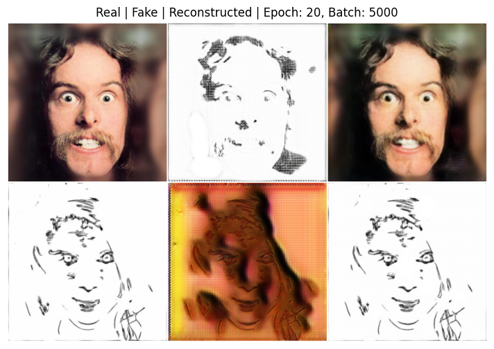

# CycleGAN & Transformer for English-Urdu Translation

This repository contains two deep learning projects implemented as part of the FALL25 Generative AI Assignment 2:

## Contents

- **Transformer for English to Urdu Translation**  
  Implements a transformer-based sequence-to-sequence model for translating English sentences to Urdu. Includes dataset downloading, preprocessing, model architecture, training, and evaluation.

- **CycleGAN for Image-to-Image Translation**  
  Implements CycleGAN for unpaired image-to-image translation. Includes model definitions (Generator, Discriminator, Residual Blocks), training loops, and sample results.

## Structure

  Transformer-based translation model.

  CycleGAN for image translation.

### CycleGAN Sample Output

Below is a sample image generated by the CycleGAN model:


## Getting Started

1. **Clone the repository**  
   ```
   git clone <repo-url>
   ```

2. **Install dependencies**  
   - Python 3.8+
   - PyTorch, torchvision
   - KaggleHub (for dataset download)
   - Other packages as required in each notebook

3. **Run Notebooks**  
   Open each notebook in Jupyter or VS Code and run the cells sequentially.

## License

This project is for educational purposes.
